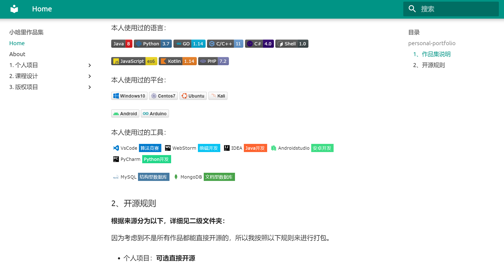

## personal-portfolio

> 个人作品集与开源规则，By gwj12345

> 最后一次更新：2023.02.03

### 1、个人作品集

考虑到为了求职、申请学校、参加比赛等各类需要。   

我试着整理一份作品集，纪录自己过往所开发过的作品及相关经验。

访问链接：http://gwj12345.github.io/personal-portfolio/

关于更新：**不定期更新到网站，以本仓库的md文档原文为准**。

### 2、开源规则

**根据来源分为以下，详细见二级文件夹：**

因为考虑到不是所有作品都能直接开源的，所以我按照以下规则来进行打包。

+ 个人项目：**可选直接开源**

+ 课程设计：**部分项目毕业后开源**

+ 版权项目：工作中写的或者参加比赛的项目是**无法开源**的。

**demo打包标准：**

虽然有些项目暂时不开源，但是为了自己复习能用。

或者给身边的相关同学朋友参考用，所以按照以下统一方式打包存档。

1. 程序测试通过，运行环境完整，确保自己下次能够运行的起来。

2. 文档材料完整，参考文献找得到来源，资料文档备份。

