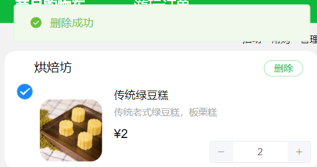
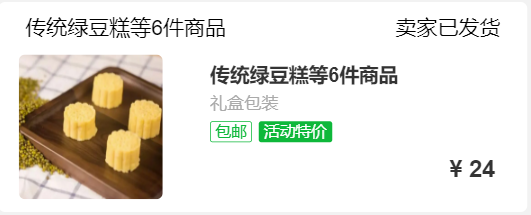
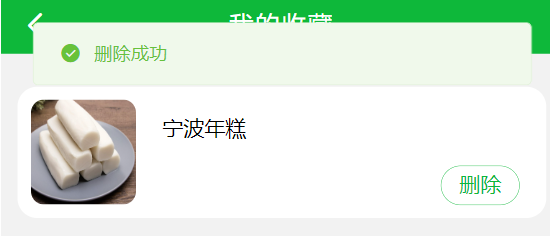

## farm-mall

#### 1、功能展示

大致分为用户管理，商品管理，收藏管理，购物车管理，订单管理五个模块。


功能展示：

| 功能模块                         | 效果展示                                                     |
| -------------------------------- | ------------------------------------------------------------ |
| 用户模块<br>———————————————————— | 1、注册时，会检测用户名是否存在：<br>2、登录时，会检测账号是否存在和密码是否正确：<br>3、注册和登录成功后的提示：<br>4、超过六小时或在其他地方登录, token失效： |
| 商品搜索模块<br>                 | 1、支持在首页或搜索页面的搜索框搜索商品：<br>2、进入搜索页面，显示搜索结果：<br>3、商品页支持加入购物车和收藏：<br/>4、未登录时，使用加入购物车会提示：<br/>5、购物车可以重复加（数量+1）而收藏具有唯一性：<br/> |
| 购物车和订单模块                 | 1、购物车商品支持增加/减少数量和删除：<br/>2、选择提交订单会清空购物车并创建一个订单：<br>3、在我的订单中可以看到商品的数量，名称和总价：<br/> |
| 收藏模块                         | 收藏支持显示与删除：<br/> |


#### 2、VueAPI

Vue 使用 axios 库进行网络请求，登录成功后将用户信息存储到localstorage中，供每次使用时调用，退出时清空信息。

```javascript
import axios from "axios";
axios({
    headers: {'Content-Type':'application/json'},
    method: 'post',
    url: 'http://gwj1314.cn:9090/user/login',
    data: JSON.stringify({
        username: this.username,
        password: this.password,
    }),
}).then(function(return_data){
    const res = return_data.data;
    console.log(res)
    if(res.message == "success"){
        _this.$message({
            message: "登录成功",
            type: "success",
        });
        //登录成功后存储用户信息
        localStorage.setItem("access", JSON.stringify(res));
        that.$router.push({path:'/wode'});
    }else{
        _this.$message.error({
            message: "登录失败,用户名或密码错误",
        });
    }
})
```

将请求获得的信息通过Data返回到Temple中

```javascript
export default {
    data(){
        var shopping = JSON.parse(window.localStorage.getItem("shopping"))
        return {
            list: shopping, //XX数据
        }
    },
    methods: {
        onSubmit(){ console.log(6); },  //XX函数
    },
    mounted () {  this.getdatas() } //每次启动时执行
};
```

Temple中支持调用data的数据和methods函数

通过v-for遍历list，{{在页面中访问list的数据}}, @click调用函数

```html
<div id="box2-1"  v-for="(item,index) in list" :key="index">
    <p id="box2-11">{{item.dianpu}}</p>
    <van-button id="del" @click="onClickDel(item.name,item.dianpu)">删除</van-button>
    
    <p id="box2-13">{{item.name}}</p>
    <p id="box2-14">{{item.jieshao}}</p>
    <p id="box2-15">¥{{item.price}}</p>
    </el-input-number>
</div>
```

配置浏览器跨越访问，请求服务端的API

```javascript
//vue.config.js
const { defineConfig } = require('@vue/cli-service')
module.exports = defineConfig({
	transpileDependencies: true,
	devServer: {
		allowedHosts: "all",
		port:9999,
		proxy: {   
            '/api': {    
                target: "http://gwj1314.cn",
                changOrigin: true,   //接口跨域
                pathRewrite: { '^/api': '/' }
			}
		}
	}
})
```


#### 3、后端部分

**使用的技术栈**

Spring Boot，MySQL，MyBatis，Spring Security，Redis

**开发工具：**

+ 云服务器 CentOS 7.9      位于腾讯云上海（公网展示）
+ 云数据库 RDS Mysql 8.0 位于阿里云杭州（部署时无需迁移数据库）
+ 本地使用 Navicat连接远程数据库并在本地进行开发和测试
+ API测试成功后将后端项目打包为jar部署到服务器上
+ API接口管理与测试采用eolink

+ 后端开发使用IntelliJ IDEA和 JDK1.8 进行

**业务逻辑实现**

+ 采用Springboot三层架构
+ Controller层实现业务控制，提供API接口访问
+ Service层实现业务逻辑，比如订单的创建，用户的认证和判断。
+ Dao层实现数据持久化，与MyBatis的mapper一对一绑定，完成数据库CURD操作。
+ entity层维护数据库表的实体类，并且其他三层中调用。


```java
//Controller层
@Controller
public class OrderController {
    // 订单服务
    @Autowired
    private OrderDao orderDao;
    @Autowired
    private ShoppingService shoppingService;

    // 获取指定用户的订单
    @GetMapping("/getorder")
    @ResponseBody
    public List<Order> getorder(@RequestParam("username") String username) {
        return orderDao.getorder(username);
    }

    // 从购物车创建订单并删除商品
    @PostMapping("/makeorder")
    @ResponseBody
    public boolean makeorder(@RequestBody Map<String,Object> params) {
        String username = params.get("username").toString();
        return shoppingService.makeorder(username);
    }
}

// Service层
@Service
public class ThingServiceImpl implements ThingService {
    @Autowired
    private ThingDao thingDao;

    @Override
    public List<Thing> getthings() {
        return thingDao.getthings();
    }

    @Override
    public List<Thing> searchthings(String name){
        return thingDao.searchthings("%"+name+"%");
    }

    @Override
    public  Thing idsget(int ids){
        return thingDao.idsget(ids);
    }
}

// Dao层
@Repository
public interface ThingDao {
    // 获取全部的商品
    List<Thing> getthings();

    // 搜索包含对应名称的商品
    List<Thing> searchthings(@Param("name") String name);

    // 查询唯一商品名称
    Thing querythings(@Param("name") String name);

    // 根据ids获取商品
    Thing idsget(@Param("ids") int ids);

}

// MyBatis
<!--绑定一个对应的Dao/Map接口-->
<mapper namespace="com.farm.dao.OrderDao">
    <!--获取指定用户的订单-->
    <select id="getorder" resultType="com.farm.entity.Order">
        select orderid, username, mess, price, photo from orders
        where username = #{username}
    </select>

    <!--获取最大的用户id-->
    <select id="getnewid" resultType="java.lang.Integer">
        select MAX(orderid) from orders limit 1
    </select>

    <!--从购物车创建订单-->
    <insert id="makeorder" >
        insert into orders(orderid, username, mess, price, photo)
        values(#{orderid},#{username},#{mess}, #{price}, #{photo})
    </insert>

</mapper>


```

**安全验证的实现**

+ 采用Spring Security的JSON Web Token (JWT)插件进行认证与授权，在信息安全上有一定保证。
+ 采用Redis数据库进行token验证，提高性能并减少计算量。
+ 用户登录时生成token签名，并存储在Redis中，每次操作前检查redis中是否存在对应token。

```java
// JWT 工具类
public static String createJWT(String jwtSec, long ttlMillis, String username) {
    // 指定签名的时候使用的签名算法，也就是header那部分
    SignatureAlgorithm signatureAlgorithm = SignatureAlgorithm.HS256;
    long nowMillis = System.currentTimeMillis();
    Date now = new Date(nowMillis);

    // 创建payload的私有声明
    Map<String, Object> claims = new HashMap<String, Object>();
    claims.put("username", username);

    // 添加payload声明
    // 设置jwt的body
    JwtBuilder builder = Jwts.builder()
        .setClaims(claims)
        .setId(UUID.randomUUID().toString())
        .setIssuedAt(now)
        .setSubject(username)
        .signWith(signatureAlgorithm, jwtSec.getBytes(StandardCharsets.UTF_8));
    if (ttlMillis >= 0) {
        long expMillis = nowMillis + ttlMillis;
        Date exp = new Date(expMillis);
        // 设置过期时间
        builder.setExpiration(exp);
    }
    return builder.compact();
}


//redis 工具类
//指定缓存失效时间
public boolean expire(String key, long time) {
    try {
        if (time > 0) {
            redisTemplate.expire(key, time, TimeUnit.SECONDS);
        }
        return true;
    } catch (Exception e) {
        e.printStackTrace();
        return false;
    }
}
//删除缓存
public void del(String... key) {
    if (key != null && key.length > 0) {
        if (key.length == 1) {
            redisTemplate.delete(key[0]);
        } else {
            redisTemplate.delete(Arrays.asList(key));
        }
    }
}
//缓存获取
public Object get(String key) {
    return key == null ? null : redisTemplate.opsForValue().get(key);
}
//普通缓存放入并设置时间
public boolean set(String key, Object value, long time) {
    try {
        if (time > 0) {
            redisTemplate.opsForValue().set(key, value, time, TimeUnit.SECONDS);
        } else {
            set(key, value);
        }
        return true;
    } catch (Exception e) {
        e.printStackTrace();
        return false;
    }
}
```

**常见的API报错码**

```txt
400: 语法无效， 如JSON参数不对。
415: 不支持其有效载荷的格式, 如没放请求头。
403: 资源不可用, 服务器拒绝处理，如目录访问错。
500: 内部错误，后端代码实现问题。
404: 请求不存在，如服务器没有对应API。

```


